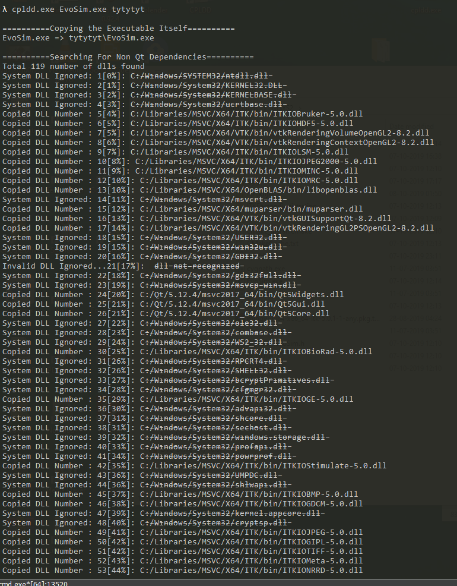
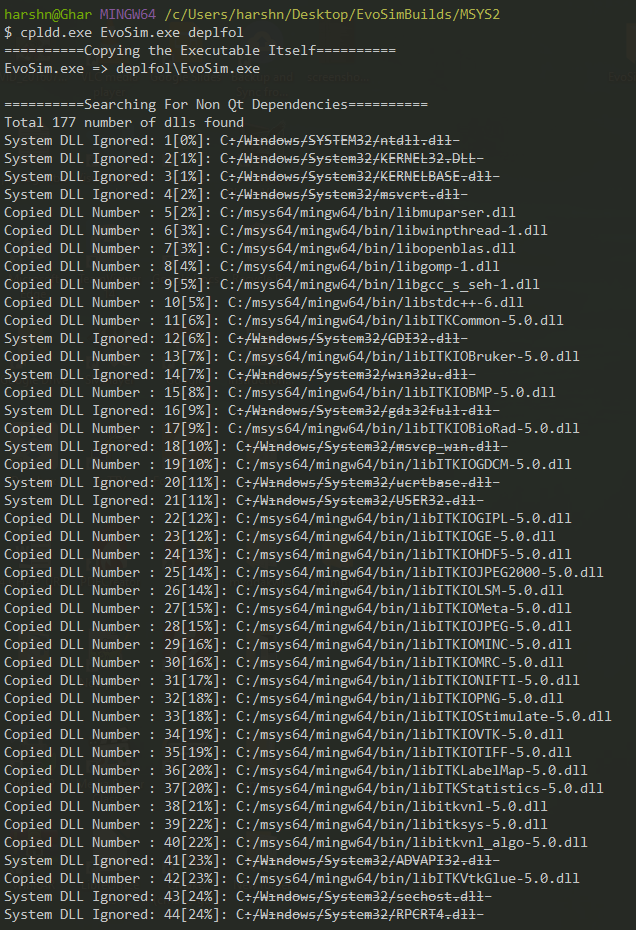

# CPLDD

CPLDD is a deployment script, written in python,  for Qt or Non Qt-C/C++ executable programs, which essentially scans and copies all "dll" dependencies into a user specified single folder along with the executable itself. CPLDD utilizes the console output of ldd.exe from msys2 project as well as windeployqt.exe for Qt/C++ applications. In general, the script can be utilized to deploy executables irrespective of the compiler toolchain(MSVC/MSYS2/Mingw/Cygwin) which was used to build the executable itself. It is assumed that the shell/cmd environment in which the cpldd is run, has all the dll dependencies available in its path. That means the executable program can be successfully run in the shell/cmd without any dll load failure. If not so, only partial dependencies which are available through shell/cmd, will be copied.

## Command line usage:

***python cpldd.py <Input_Exe_File> <Output_Folder_Path>***

***cpldd.exe <Input_Exe_File> <Output_Folder_Path>***

### Optional Arguments:

**-f** : Force dependencies from "system32" folder to be copied to the deployment folder, which is often undesired and un-necessary.

## Sample Output:
The following two screenshots show console outputs when a C++ executable, which is an outcome of very complicated project with tons of dependencies (Qt//VTK/ITK/OpenBlas/muParser/Armadillo/tinyxml2 ...) is deployed using CPLDD. The two screenshots only differ by the compiler tool chain (MSVC vs MSYS2), which can be clearly seen in the output.

  
  

Despite all the complicated dependencies, CPLDD has been shown to be successful 100%. 
